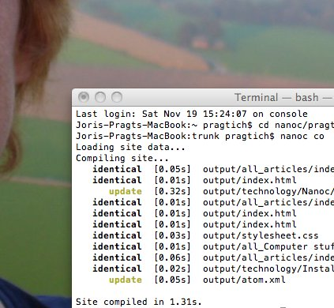

--- 
title: Making a personal website using Nanoc
kind: article
category: Computer stuff
created_at: November 12, 2011
indeximage: Nanoc_index.jpg
summary: "How I used Nanoc to create this personal webpage"
comment_id: nanoc
---

I have previously played around with different systems for creating a personal webpage. Working in HTML quickly frustrated me because it is in essence illegible. Also, it made no sense to me to have to repeat all the layout and navigation stuff in each page.

My first real attempt at a personal page already had the design that is close to what is here now. I made it using Apache Cocoon, and the abstraction level really appealed to me. However, in practical use it turned out to be way too heavy on the server. The once-supercoputer server I was using (a SGI Indigo) could not handle the java. I ended up using a web spider to convert everything into static pages, not really a satisfactory approach.

Now, years later, i am playing with Nanoc. It is one of a range of static webpage generation tools that have sprouted since the Ruby programming language has become popular. 

Nanoc is reasonably well documented (the objects very well, the use a bit less detailed), and there is a community site that includes several examples of web sites which are a great help. To set up my site, I used two main sources: The Nanoc website and the Schof.org site by Mark Schofield. Especially the practical example of schof.org has been a great help.

An RSS feed for the site
=================

Of course, a blog should have a RSS feed. Even though you have no readers yet... One never knows when it will be useful.

So, I am trying to get the Blogging helper RSS stuff to work. The [documentation](http://nanoc.stoneship.org/docs/api/3.1/Nanoc3/Helpers/Blogging.html#atom_feed-instance_method) shows that we need to set up some stuff. I did just that, although I must say I really dislike the `excerpt` tag, because of its American English brutality. I will try to come up with a way to use `summary` instead.

    base_url: 'http://http://members.home.nl/pragtich'

Created a `content/atom.xml` with the contents:

     <%%= atom_feed %>

And created `content/atom.yaml` with:

	title: Joris Pragt's blog feed
	author_name: Joris Pragt
	author_uri: http://members.home.nl/pragtich
	is_hidden: true

Edited `Rules` to add:

	compile '/atom/' do
	  filter :erb
	end

	route '/atom/' do
	  '/atom.xml'
	end

Maruku threw some errors. Switched to Kramdown and all is well. 

I was confused for a while, because no orange icon was showing. Turns out that Firefox has removed the RSS feed icon from the toolbar. You can add it with `customize`, but even then it is oly black and gray. Not such a clear message anymore, compared to the old way. 
